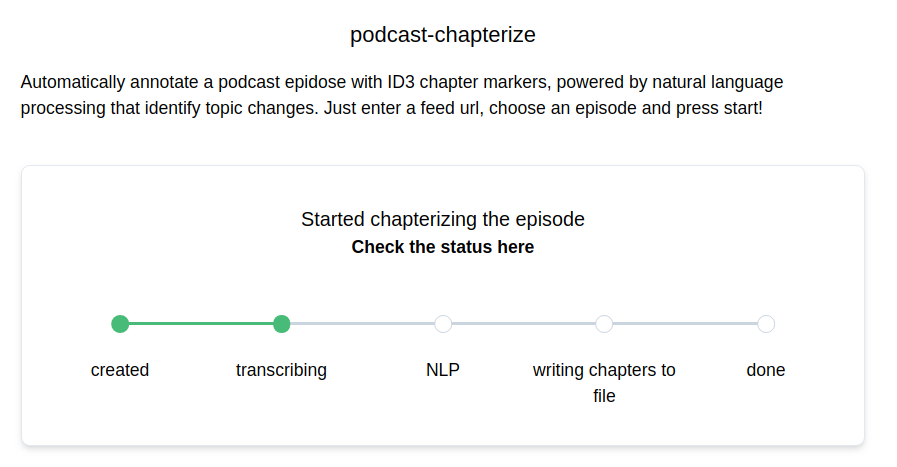
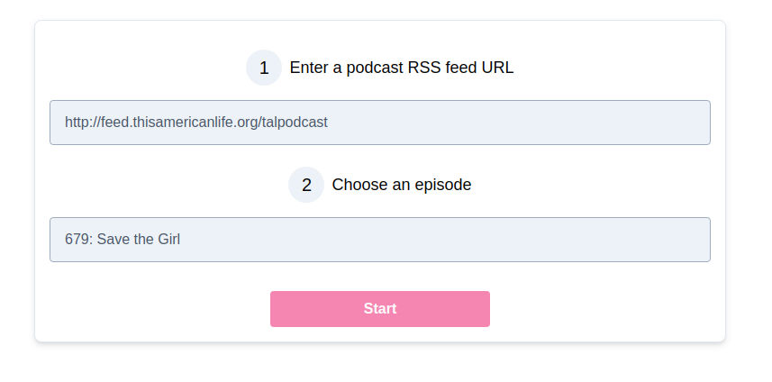
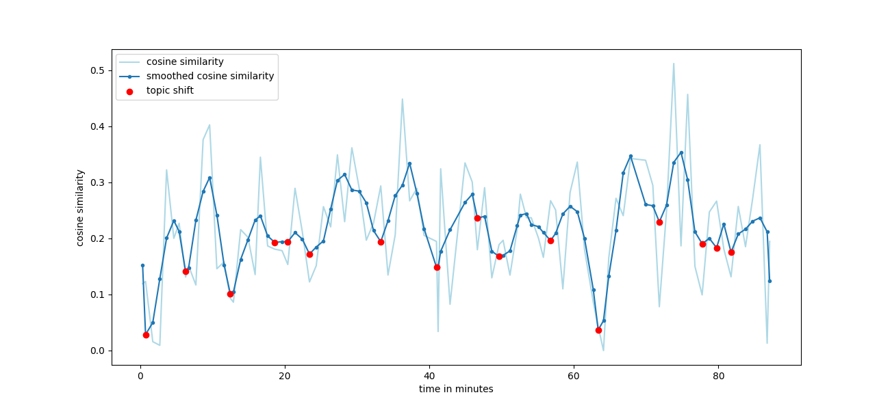
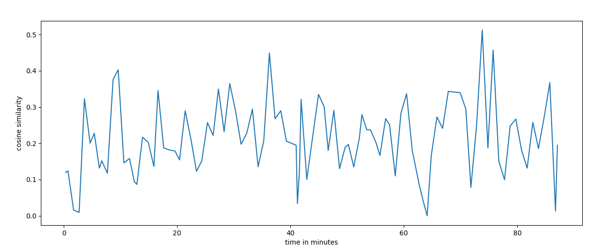
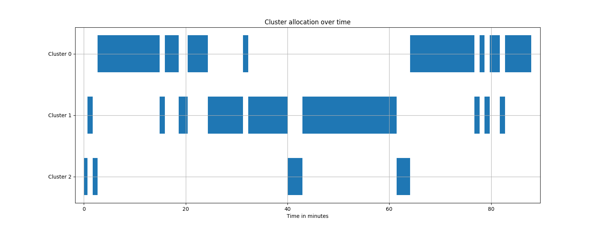
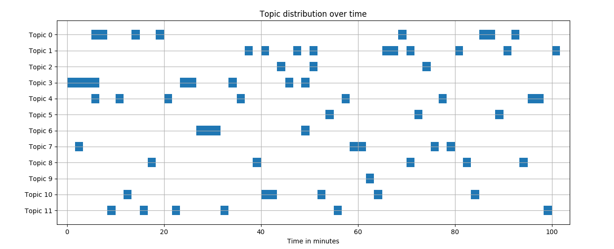

# podcast-chapterize 

This project aims to automatically provide longform audio podcast episodes with chapter markers. This is achieved with statistical natrual language processing algorithms that try to subdivide transcribed podcast episodes into topically cohesive parts.

[work in progress]

### Requirements
* ffmpeg
* matplotlib ([intall via package manager](https://matplotlib.org/3.1.1/users/installing.html#linux-using-your-package-manager))
* Python modules (installable via requirements.txt)
  * feedparser
  * flask
  * flask_cors
  * tinydb
  * wget
  * nltk
  * sklearn
  * google-cloud-storage
  * google-cloud-speech
  * eyed3

## Journal

### 14.09.2019
* Implemented support for german
  * using stemmer instead of lemmatizer
  * language choice in CLI (main.py) and web interface
  * language detection through RSS 'language'-tag

### 13.09.2019
* Refinment of identified boundaries: Add maxUtteranceDelta parameter
  * when finding closest utterance boundary for each inferred topic boundary, only choose utterance boundary if △ token position of topic boundary and utterance boundary is not larger than maxUtteranceDelta
* web interface:
  * add client persistence for started job (save in localstorage)

### 11.09.2019
* Add command line argument parsing for main script
* created output/ directory that contains processed audio files, transcripts and chapters text files, make available through flask

### 23.08.2019
* get segment-specific important tokens for each infered topically cohesive segment:
  * after boundary identification, subdivide transcript by identified boundaries
  * vectorize segments and apply tfidf-weightig
  * extract list of tokens with the hightest weight for each segment
  * use those tokens as chapter names
* frontend
  * refactor: move all api calls to resources.js file
  * add option to search for job by job id input

### 21.08.2019
* frontend:
  * add podlove web player to play chapterized episode
  * **ToDo**: move all api calls to store function to avoid duplicate axios calls, central api url definition 
* backend:
  * create endpoint /player-config to get generated podlove player config (with metadata like title, links and chapters)

### 20.08.2019 
* switch job status management from textfile-based to tinydb
* web client:
  * added web interface for starting chapterize job
  * added interface that gives status info about the job
* server
  * implemented API endpoints /job (POST) for creating a job; /status for getting job info



### 18.08.2019
* web frontend:
  * implement first step (URL entry and choice of episode)
* backend API with flask:
  * Add /episodes endpoint (GET, params: feedURL, returns last 10 Episode names of feed)



### 17.08.2019
* Begin development for web frontend and backend (using [this](https://testdriven.io/blog/developing-a-single-page-app-with-flask-and-vuejs/))
  * frontend: vue-based app created with vue-cli,  tailwindcss for fast prototyping styles
  * backend: flask (backend framework written in python) for dynamic page rendering and API for nlp script execution/ job management

### 13.08.2019
* main script
  * add cosine similarity script as boundary detection
  * write boundary times to file
  * add chapter matkers to original mp3 file
  * **first prototype of complete pipeline done**
    * *audio file --> transcript --> boundary detection --> chapter markers in original audio file*
  * chapter titles still missing
    * TF-IDF weighted tokens for each section as chapter names?
    * topic modeling on segmented transcript to infer topics?

### 10.08.2019
* cosine similarity
  * implement set exact segment word length length
  * for each found local minima, find closest utterance boundary

### 09.08.2019
* add jobs handling in main script
* add write chapters function to write id3 chapters to mp3 files
  * creates textfile with chapters and chapter titles

### 07.08.2019
* add smoothing function (Savitzky-Golay filter) for cosine similarity plot
  * Can smoothing be used here? Smoothing is done on the array of cosine similarity scores per segment shift, while each segment has a variable length (coming from google speech api's utterance detection). So smoothing is done on a plot where [x = # segmentShift], but should be done where [x = t or x = # tokens], but [should be done on equally spaced data](http://wresch.github.io/2014/06/26/savitzky-golay.html)
    * Solution: calculate cosine similarity score for segments of a set length
    * **but information about utterance boundaries gets lost** Solution: after topic boundary detection (smoothing, local minima), for each detected topic boundary, set nearest utterance boundary as actual topic shift point. Because:
      * Topic shifts most likely occur at utterance boundaries
      * Even if an actual topic boundary is not exact at this point, point is still in between utterances
  * parameters for Savitzky-Golay filter (window length and polyorder) vary result vastly, needs some more testing
* add minima calculation for smoothed cosine similarity plot (minima should be points of topic change)
* add visualization of minima detection (x values misaligned because data is not equally spaced for smoothing, see above)
  * raw vs smoothed plot & local minima, Pod Save America Episode "Racist Hall of Fame":
  

### 01.08.2019
* Add minimum segment length parameter to lda and hdp approaches

### 30.07.2019
* New approach: calculate lexical similarity via cosine similarity of adjacent text segments
  * cosine similarity score (dot product) is calculated for pairs of documents, based on tf-idf weighted term-document matrix
  * algorithm considers position of segments in text as well because only adjacent segments are compared for similarity, versus clustering and topic modeling approaches that see the documents in corpus not as a segmented parts of a consecutive whole, but as documents in no particular order
  * minSegmentLength attribute can be set to combine adjacent segments if the word count is below a threshold value to reduce the number of very short segments that are not useful/ representative in similarity analysis
  * plot for cosine similarity (y) for each segment shift, projected on the segment start/ end times (x):
  
    * a high cosine means high similarity, so valleys in this plot signal low similarity -> topic shifts
    * here, valleys represent actual topic shifts, i.e. advertisement breaks at minute 61-63 and minute 39-43 and topic shift at minute 64
  * next steps: boundary indentification (find local minima in plot)
  * topic modeling after text segmentation to find topic terms?

### 21.07.2019
* For k_means clustering, optimize for k (number of clusters)
  * "elbow"-approach (optimize_k_elbow function)
    * can not find elbow, problem with tfidf vector?
  * [silhouette analysis](https://scikit-learn.org/stable/auto_examples/cluster/plot_kmeans_silhouette_analysis.html) approach (optimize_k_silhouette function)
    * local maximums give values for k that work well, when there are multiple high silhouette score averages in the search range for k, choose the high point with the lowest k
    * example: [**Pod Save America** Episode "Racist Hall of Fame"](https://crooked.com/podcast/racist-hall-of-fame) 
      * plot of silhouette score averages for k in range (2, 20); at k=3 there is a local maximum
      
      * cluster allocation over time for k=3
      
      * Actual topic changes occur at t≈22 and t≈64; advertisement breaks occur at minute 61-63 and minute 39-43, which is almost perfectly represented by cluster 2; **promising results!!**
      * for k_cluster function, parameter tfidf2D=True has to be set if number of topics is determined with silhouette analysis
      * Improvement: exclude segments with less than x tokens?

### 19.07.2019
* Exploration of different approaches to text segmentation, as topic modeling first approaches yielded not very usable results:
  * Using a neural network ([Attention-based Neural Text Segmentation](https://arxiv.org/pdf/1808.09935.pdf))
  * [Text segmentation of spoken meeting transcripts](https://link.springer.com/content/pdf/10.1007%2Fs10772-009-9048-2.pdf)
    * based on TextTiling algorithm with lexical chaining and refinment using cue phrases
    * specifically for transcripts of spoken multi-party conversation (text that is rarely eypository and has a "poor structure, spontaneous nature of communication and often argumentative nature as well as their infor-mal style" (p.1re))
    * refinment using cue phrases is difficult when trying to achieve wide-domain application for many different podcasts, this step can be skipped
* Add plot of cluster allocation over time for kmeans clustering approach
* Update transcribe/transcribe_google.py script to include utterance structure from google speech to text api in json transcript output (google speech api gives usable segmentation of longform audio into utterances or segments, useful for eliminating segmentation with an arbritarily chosen segment width for preprocessing)
  * adapted kmeans, LDA and HDP approach to accept new transcript format; **topic/ cluster over time plot needs adjustment because of variable segment lengths**

### 17.07.2019
* Add plot of topic distribution over time with matplotlib for lda approach (ToDo: add graph to hdp and k-means approach)
  
* For segmentaiton, the LDA approach yields not much useful results, as consecutive transcript segments often are not labeled with the same topic, so grouping segments together is difficult. Reasons for this could be:
  * the arbritary chosen segmentation (i.e. 30s segments) of the transcript produces very fuzzy segments that may or may not contain topic-related tokens and are in itself not contained entities
  * hyperparameters need to be tuned: segment width, number of topics, passes through data
    * could try out automated parameter tuning, maybe optimize no of topics with perplexity value (https://www.mathworks.com/help/textanalytics/ug/choose-number-of-topics-for-LDA-model.html)
  * **differnent approach: topic modeling after (k-means) clustering for labeling segments?**

### 14.07.2019
* Testing of [TextTiling](https://www.aclweb.org/anthology/J97-1003) algorithm:
    * The TextTiling algorithm is unsuitable for this problem because it needs the input to be structured into paragraphs, as the algorithm groups together paragraph units into multiparagraph sections that are topically coherent. Output of the text to speech api can not infer this text structure and is more comparable to a text stream.
    * In addition, 'TextTiling is geared towards expository text; that is, text that explicitly explains or teaches, as opposed to, say, literary texts, since expository text is better suited to the main target applications of information retrieval and summarization.' (Hearst 1997, 35)
    * Marti A. Hearst, Multi-Paragraph Segmentation of Expository Text. Proceedings of the 32nd Meeting of the Association for Computational Linguistics, Los Cruces, NM, June, 1994. 
* Added topic modeling visualization of LDA model with [pyLDAvis](https://github.com/bmabey/pyLDAvis) module, outputs html file visual.html
  
* [WIP] matplotlib visualization of (lda) topic distribution over time in a (discontinuous) horizontal bar chart with **x: time**; **y: topic (categorical)**

### 12.07.2019

* for kmeans cluster switched to sklearn workflow (scikit learn, better docs and more accessible)
* improved approach 3 (kmeans clustering) with TF-IDF vectorizer:
  * with a section length of 30s, groups of clusters can be made out easily:
    (Podcast "Hello Internet", Episode #125)
    ```
    Section from min 0.67 assigned to cluster 11
    Section from min 1.37 assigned to cluster 10
    Section from min 2.05 assigned to cluster 10
    Section from min 2.73 assigned to cluster 10
    Section from min 3.4 assigned to cluster 10
    Section from min 4.07 assigned to cluster 7
    Section from min 4.75 assigned to cluster 7
    Section from min 5.42 assigned to cluster 7
    Section from min 6.12 assigned to cluster 7
    Section from min 6.8 assigned to cluster 7
    Section from min 7.47 assigned to cluster 7
    Section from min 8.15 assigned to cluster 7
    Section from min 8.82 assigned to cluster 1
    Section from min 9.5 assigned to cluster 11
    Section from min 10.17 assigned to cluster 2
    ```
* Similar to approach 1, the number of clusters needs to be determined beforehand. Making this approach work with many different podcasts and episode lengths could be difficult, maybe a variable number of clusters depending on the length of the podcast episode could be a solution.

### until 12.07.2019

Created first running prototype with the following features:

* podcast feed parsing (transcribe/parse_rss.py)
  * parse rss/ atom feed
  * grab latest episode (or specify episode no)
  * grab relevant podcast episode audio file
* preprocess audio file (transcribe/transcribe_google.py)
  * convert audio to LINEAR16/ PCM encoded wav using ffmpeg
* transcribe audio file using google speech api (transcribe/transcribe_google.py)
  * upload file as blob to google cloud storage
  * run speech recognition on blob
  * postprocess transcript (create array with elements {token, time of occurrence}) 

Three different approaches were taken so far to prepare the automatic segmentation of the document:

1. topic modeling of segments: LDA (Latent Dirichlet Allocation) (lda_json.py)
  * preprocess:
    * segment transcript into 20 second chunks (consecutive segments, could sliding window approach with overlapping segments give better results?)
    * lowercase, lemmatize and remove stopwords (using nltk module)
    * create a dictionary and filter extremes
    * create bag of word (bow) corpus
    * create tf-idf corups from bow corpus
      * **using a bow corpus weighted with TF-IDF (Term Frequency–Inverse Document Frequency) gives less weight to non-topic-relevant stopword-like tokens (that have high occurrence in spoken word transcripts) compared to a simple frequency vector represtation of the document**
  * topic modeling
    * create lda model with params: num_topics=12, passes=2 (these hyperparameters need tuning), using gensim module
    * print topics + topic tokens 
    * print topic distribution for each 20s-segment

2. topic modeling of segments: HDP (Hierarchical Dirichlet Process) (hdp_json.py)
  * preprocess: see lda preprocessing
  * topic modeling
    * create hdp model
    * print topics + topic tokens 
    * print topic distribution for each 20s-segment

3. k-means clustering of segments (kmeans_cluster.py)
  * preprocess:
    * segment transcript into 20 second chunks (consecutive segments, could sliding window approach with overlapping segments give better results?)
    * lowercase, lemmatize and remove stopwords (using nltk module)
    * create bow corpus with one-hot vectorizing (using nltk module)
  * clustering
    * create k-means model with params: distance=nltk.cluster.util.cosine_distance
    * for each 20s segment print cluster allocation

#### First results

**Approach 1** gives first usable results, but adjusting parameters like the segment length and the lda model hyperparameters could improve the model. The need to specify the number of topics beforehand is a big caveat for the universal application of the method to differnet podcasts, that vary greatly in topic density and occurrence. One possible solution is to determine a mean topic occurrence per time unit and then make the number of topics depend on the length of the podcast episode.

**Approach 2**: The HDP model can infer the number of topics itself, which is a big advantage over LDA (approach 1). Still, results are not yet usable. Improvements in hyperparameters and text segmentation could help here too.

**Approach 3**: Results of clustering do not yet give usable results. Preprocessing could be improved (use TD-IDF with a cutoff weight to filter out non-relevant tokens before one-hot encoding?)
